# Palestine Cities Explorer

A beautifully designed Flutter mobile application that takes users on a journey through the history, culture, and heritage of four iconic Palestinian cities.

🌐 **Live Demo:** [https://salma-abuodeh.github.io/palestinian-cities-app/](https://salma-abuodeh.github.io/palestinian-cities-app/)

---

## 📱 Screenshots

<table>
  <tr>
    <td align="center">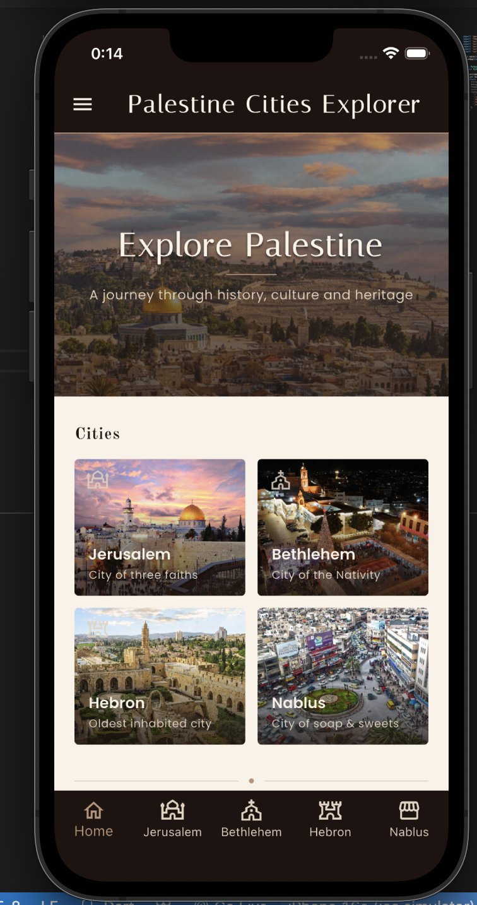<br/><sub>Home Screen</sub></td>
    <td align="center">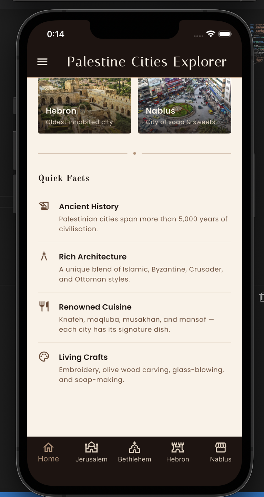<br/><sub>Quick Facts</sub></td>
    <td align="center">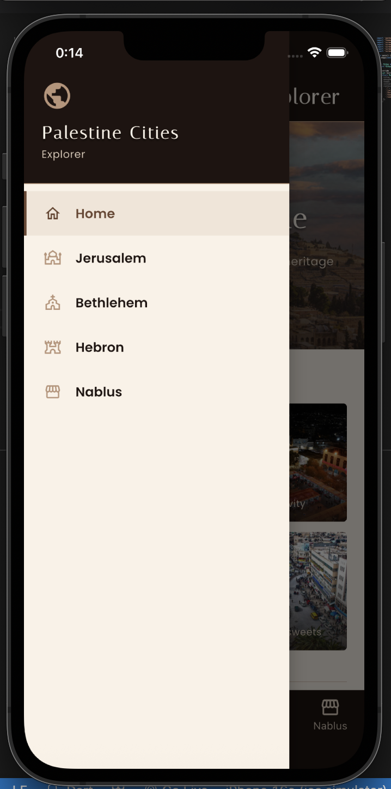<br/><sub>Drawer Navigation</sub></td>
  </tr>
  <tr>
    <td align="center">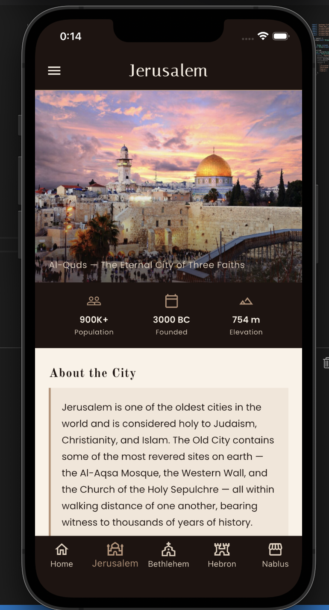<br/><sub>Jerusalem</sub></td>
    <td align="center">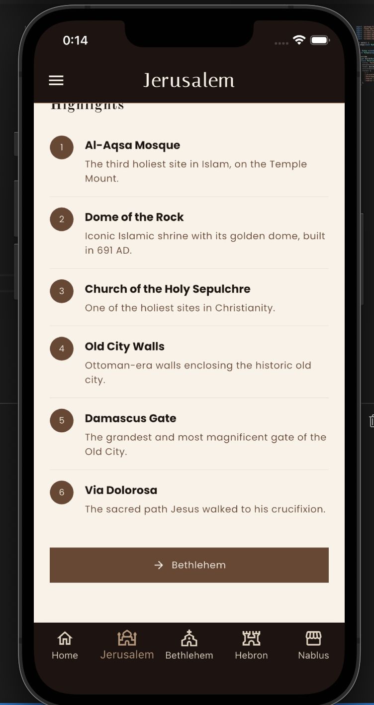<br/><sub>Jerusalem Highlights</sub></td>
    <td align="center">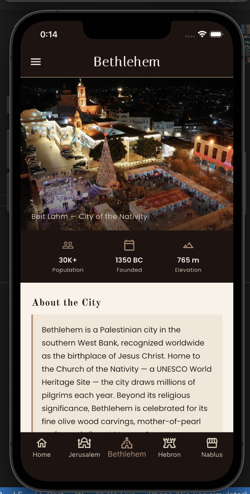<br/><sub>Bethlehem</sub></td>
  </tr>
  <tr>
    <td align="center">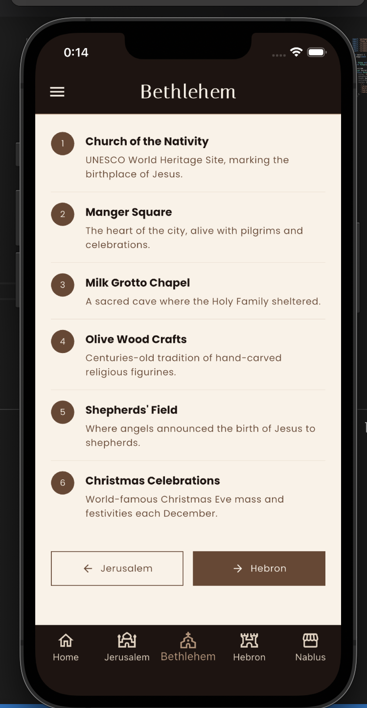<br/><sub>Bethlehem Highlights</sub></td>
    <td align="center">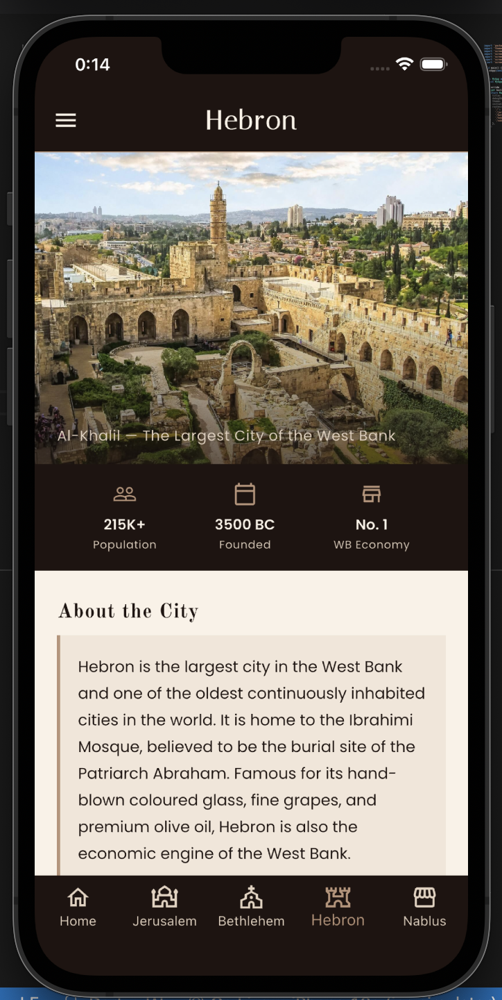<br/><sub>Hebron</sub></td>
    <td align="center">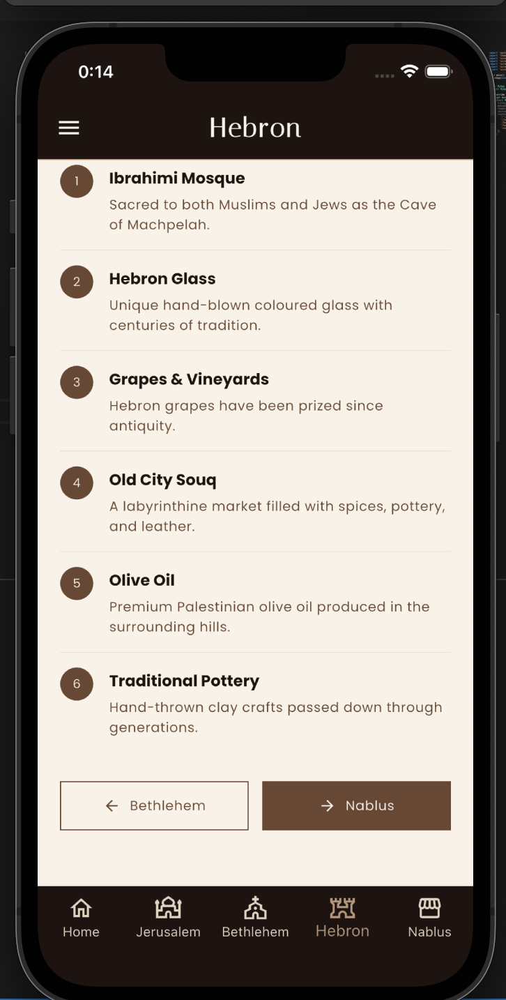<br/><sub>Hebron Highlights</sub></td>
  </tr>
  <tr>
    <td align="center">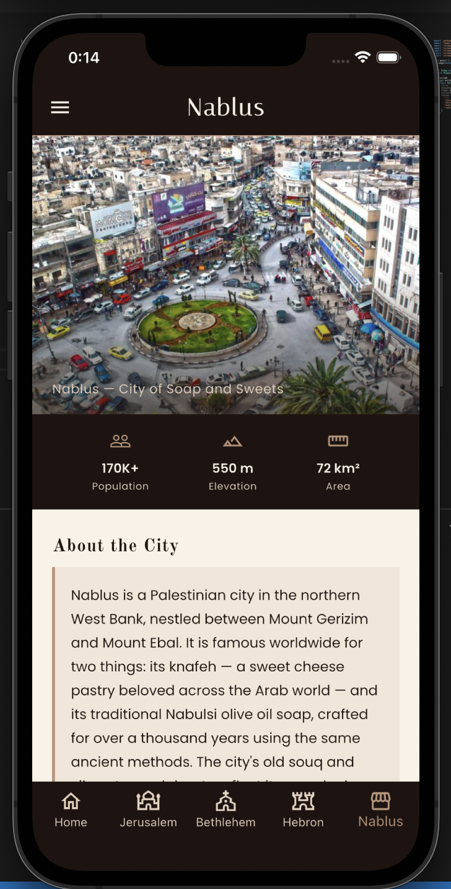<br/><sub>Nablus</sub></td>
    <td align="center">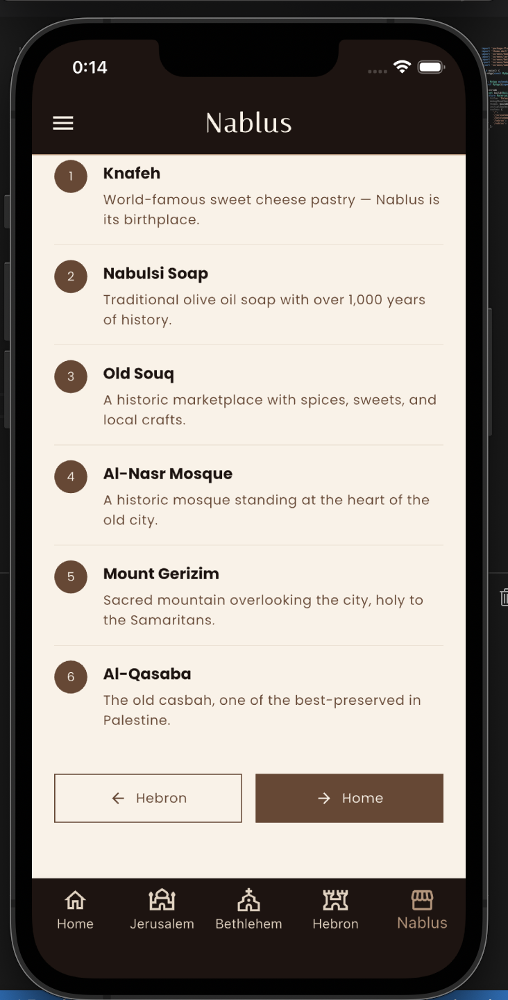<br/><sub>Nablus Highlights</sub></td>
    <td></td>
  </tr>
</table>

---

## 🏙️ Cities Featured

| City | Arabic Name | Known For |
|------|-------------|-----------|
| **Jerusalem** | القدس | Al-Quds — The Eternal Heart of Palestine |
| **Bethlehem** | بيت لحم | City of the Nativity — birthplace of Jesus Christ, UNESCO World Heritage Site |
| **Hebron** | الخليل | Oldest continuously inhabited city — Ibrahimi Mosque, Hebron Glass, olive oil |
| **Nablus** | نابلس | City of Soap & Sweets — Knafeh, Nabulsi soap, Mount Gerizim |

---

## ✨ Features

- 🏠 **Home screen** with a hero image, city grid cards, and quick facts section
- 🗺️ **Individual city pages** with photo header, key stats, description, and highlights list
- 📋 **Side drawer** for quick navigation between all cities
- 🔽 **Bottom navigation bar** consistent across all screens
- ➡️ **Sequential navigation** buttons to move between cities
- 🎨 **Warm heritage aesthetic** — cream, sand, and brown color palette
- 🔤 **Google Fonts** — Italiana, Old Standard TT, Poppins

---

## 🛠️ Tech Stack

- **Framework:** Flutter
- **Language:** Dart
- **Fonts:** Google Fonts (`google_fonts`)
- **Navigation:** Named routes + Drawer + BottomNavigationBar
- **Assets:** Local image assets

---

## 🚀 Run Locally

```bash
# Clone the repository
git clone https://github.com/salma-abuodeh/palestinian-cities-app.git

# Navigate into the project
cd palestinian-cities-app

# Install dependencies
flutter pub get

# Run the app
flutter run
```

> Requires Flutter SDK installed. [Get Flutter →](https://flutter.dev/docs/get-started/install)

---

## 🌐 Deploy (Flutter Web)

```bash
flutter build web --base-href "/palestinian-cities-app/"
git subtree push --prefix build/web origin gh-pages
```

---

## 👩‍💻 Author

**Salma Abu Odeh**  
Software Engineering Student — Bethlehem University  

---

## 🎓 Course Project

This app was developed as a course project for  
**SWER354 — Advanced Web Technologies**  
Faculty of Engineering and Technology, Bethlehem University

---

> *"A journey through history, culture and heritage."* 🇵🇸